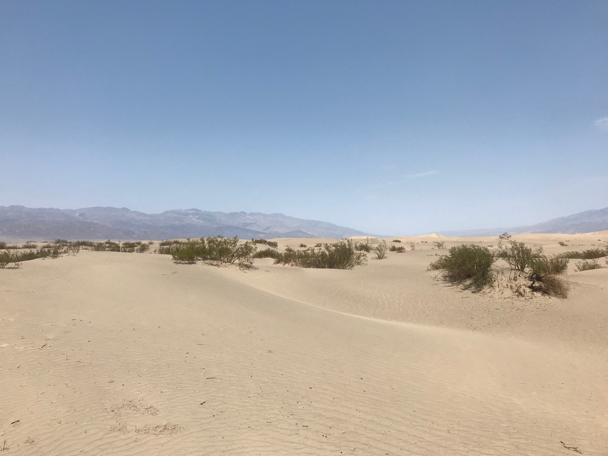
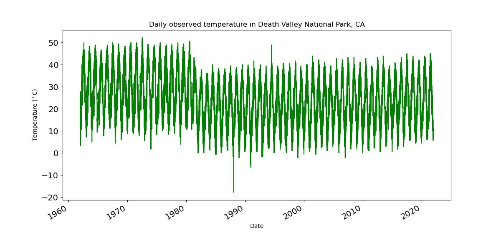
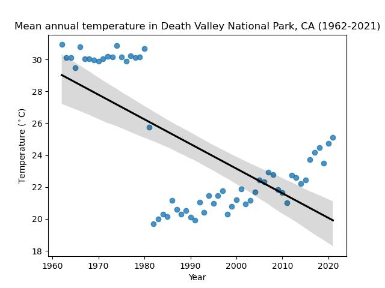
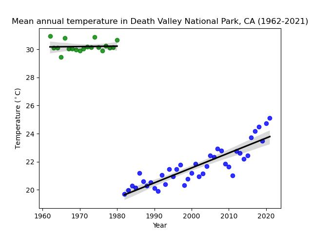
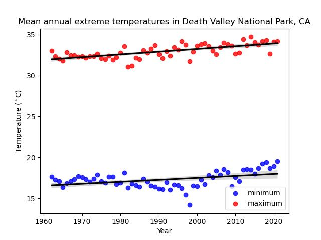

## Climate Change: Death Valley National Park

<figure>
  
  <figcaption align="center"><b>Figure 1. Death Valley Sand Dunes California</b> </figcaption>
</figure>

There are a variety of climate change indicators available to the average observer. 
Temperature is one of the most persistent measures of climate change, because it is always available to be measured. Furthermore, most people have a reliable frame of reference for temperature 
and how it impacts their daily lives. While individuals might look at the forecast or actual temperature of their surroundings regularly, it is the long term time history of these temperatures that tells the story of climate change. 
Fortunately for those interested in looking at such time histories, the National Oceanic and Atmospheric Administration (NOAA) has an 
archive of global historical weather and climate data for weather stations across the United States and around the world in the [Climate Data Online](https://www.ncei.noaa.gov/cdo-web/) website.

This portfolio exercise directed an evaluation of available temperature observation data to assess if data trends indicate climate change for a location of interest. 
Death Valley National Park was selected for this exercise not only for its renown as one of the hottest places on earth but also because the author spent several years 
living in the high desert within driving distance of Death Valley. The map below shows the perimeter of Death Valley National Park in California. The red dot is weather station source for the NOAA data located at 36.46263°, -116.8672° and an elevation of -59.1 m.

<figure>
  <embed type ="text/html" src ="img/dvnp_wxs.html" width="600" height="600">
  <figcaption align="center"><b>Figure 2. Map of Death Valley National Park perimeter and the data source weather station</b> </figcaption>
</figure>

The NOAA CDO daily summary station for Death Valley National Park shows a period of record of 26 Apr 1961 to the current month. While there are minimum and maximum values recorded through the 2026 data, the observed temperature values are NaN starting in 2022. This was verified by spot checking data using the Quick Data reports on the [station website](https://www.ncdc.noaa.gov/cdo-web/datasets/GHCND/stations/GHCND:USC00042319/detail). Further research revealed that changes were made to some of the Death Valley data collection after 2021 and there are changes being made to how Death Valley data is being stored and reported digitally as the [Death Valley Climate Book](https://www.weather.gov/vef/deathvalley_climatebook). Following preliminary examination of the data, it was determined that due to the large temperature swings of the high desert, using the partial year data for 1961 created a large disparity between the annual average temperature calculations for 1961 and for 1962 and later. Thus, the data was filtered to run from 1 Jan 1962 to 31 Dec 2021.

 
>**Figure 3. Death Valley Weather Station Daily Observed Temperatures**
>*Daily observed temperatures show the range of temperatures experienced in a high desert environment. This plot also shows the change in temperature observation time in 1981.*

<figure>
  
  <figcaption align="center"><b>Figure 3. Death Valley weather station daily observed temperatures showing the range of high desert environment temperatures and how observation time impacts observations</b> </figcaption>
</figure>

In order to better visualize the temperature trends, an annual average observed temperature was calculated and plotted for each year. 

<figure>
  <embed type ="text/html" src ="img/annual_temp_plot_death_valley.html" width="600" height="300">
  <figcaption align="center"><b>Figure 4. Annual average observed temperature at Death Valley National Park (1962-2021) and the dependence of that value on the time of data collection</b>
The average annual observed temperature shows the dramatic change in average temperature when measurements were collected in afternoon versus the morning or overnight.
 </figcaption>
</figure>

In both of these plots, there is a clear shift in the daily observed temperature range. Further investigation found [documentation](https://www.weather.gov/media/vef/Climate/Death%20Valley%20Climate%20Book/Precipitation%20History%20%26%20Synopsis.pdf) that in 1981 the observation collection time, for both temperature and precipitation, shifted from 1600 Local Standard Time (LST) to 0800 LST with 31 May 1981 being the last data collection at 1600 and 1 Jun 1981 being the first data collected at 0800. Furthermore, on 2 Nov 2015, the observation collection time shifted to 2359 LST, though the shift from 0800 to 2359 is not visually significant on the plots. 

An ordinary least squares (OLS) linear regression was fit for the complete set of observed temperature data. The trend line slope for the full data set is -0.154 deg C per year. The change in data collection protocols clearly impacted the regression and trend line calculations and overrode the growth of average temperatures. The OLS regression was repeated on the data split into two groups, the 1600 LST observations and the 0800 and 2359 LST observations. Given that there are only six data points in the 2359 LST observation set, that data remained with the 0800 LST data instead of being broken into a third data set. The trend line slopes calculated for the separated group were 0.003 deg C per year for the years 1962 to 1979 and 0.106 deg C per year for the years 1981 to 2021.

<figure>
  
  <figcaption align="center"><b>Figure 5. Death Valley National Park observed temperature trends are distorted by the change in data collection protocols </b></figcaption>
</figure>

<figure>
  
  <figcaption align="center"><b>Figure 6. Death Valley National Park observed temperature trends grouped by observation time </b> 
XX</figcaption>
</figure>

Given this significant change in temperature data collection, it was decided to include the maximum and minimum temperature values as part of the regression evaluation for a more continuous data set across the time period. Comparing the annual average minimum and maximum temperature values to the observed temperature values, it is clear that the trends calculated for the observed temperatures were disrupted by the change in data collection protocols. The trend line slope for the maximum temperature was 0.033 deg C per year and 0.024 deg C per year for the minimum temperature. 

<figure>
  <embed type ="text/html" src ="img/annual_all_temps_plot_death_valley.html" width="600" height="300">
  <figcaption align="center"><b>Figure 7. Comparison of annual average temperatures at Death Valley National Park (1962-2021) for minimum, maximum, and observed temperature data sets show the impact of the temperature observation protocol change to the data set</b>

 </figcaption>
</figure>

<embed type ="text/html" src ="img/annual_all_temps_plot_death_valley.html" width="600" height="300">
*Annual Average Temperatures at Death Valley National Park (1962-2021)*

<figure>
  
  <figcaption align="center"><b>Figure 8. Death Valley National Park minimum and maximum temperature trends</b> 
XX</figcaption>
</figure>

